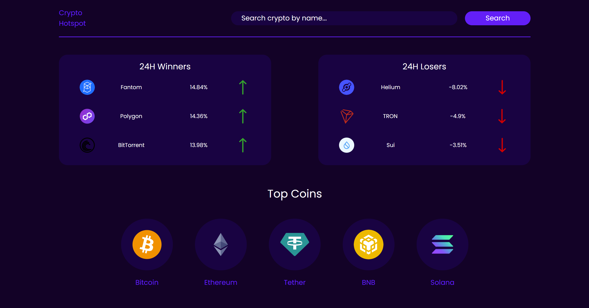
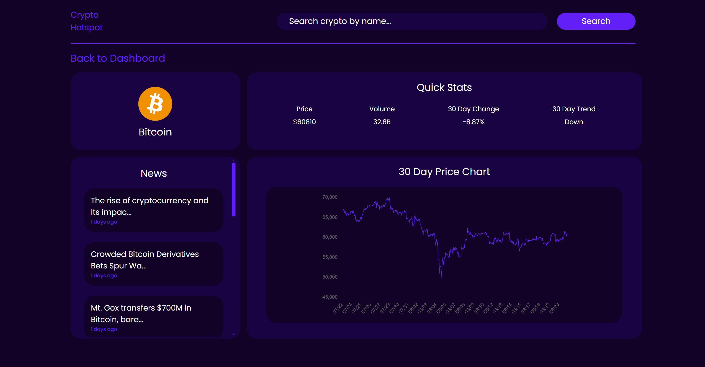

# Cryptocurrency Tracker

A Django-based web application for tracking cryptocurrency prices, 24-hour winners and losers, and other key metrics. This tool allows users to search for specific cryptocurrencies, view detailed statistics, analyze price trends, and stay updated with the latest news.




## Features

- **24-Hour Winners and Losers:** Display the top gainers and losers in the cryptocurrency market over the last 24 hours.
- **Top Coins:** View the most popular cryptocurrencies.
- **Search Functionality:** Search for any cryptocurrency by name or symbol and view detailed statistics.
- **Trend Analysis:** View 30-day price trends with an interactive chart.
- **News Feed:** Get the latest news related to the selected cryptocurrency.
- **Responsive Design:** The application is fully responsive, providing an optimal viewing experience across all devices.

## APIs Used

This project uses the following APIs to fetch data:

- **[CoinGecko API](https://www.coingecko.com/en/api):** Provides data on cryptocurrency prices, market trends, and other relevant metrics.
- **[News API](https://newsapi.org/):** Supplies the latest news articles.

Make sure to obtain API keys (if required) and set them up in your environment variables as part of the installation or deployment process.

## Installation

### Prerequisites

Ensure you have Python 3.x installed on your system. You can download it from [python.org](https://www.python.org/).

### Required Python Packages

This project requires the following Python packages:
- `Django`
- `requests`

You can install them using `pip`:

```bash
pip install django requests
```

### Setting Up the Project

1. Clone this repository to your local machine:

   ```bash
   git clone https://github.com/ry-schwartz/cryptocurrency_tracker.git
   cd cryptocurrency_tracker
   ```
2. Ensure all dependencies are installed (as mentioned above).

3. Run database migrations:

    ```bash
   python manage.py migrate
   ```

4. Collect static files:

    ```bash
   python manage.py collectstatic
   ```

5. Set up environment variables for the API key(s):

    ```bash
   export CRYPTONEWS_API_KEY='your-cryptonews-api-key'
   ```

### Usage

To run the application locally, navigate to the project directory and execute the following command:

   ```bash
   python manage.py runserver
   ```

1. Open your web browser and go to `http://127.0.0.1:8000/`.
2. Click on any cryptocurrency to view its detailed stats, 30-day price chart, and related news.
3. Use the search bar on the home page to find a cryptocurrency by name or symbol.

### Deployment on Heroku

This project is configured to be deployed on Heroku. Follow these steps:

1. Ensure you have the Heroku CLI installed.

2. Log in to your Heroku account:

    ```bash
   heroku login
   ```

3. Create a new Heroku application:

    ```bash
   heroku create cryptocurrency_tracker
   ```

4. Set up the environment variables required for the project:

    ```bash
   heroku config:set SECRET_KEY='your-secret-key'
   heroku config:set DEBUG=0
   heroku config:set CRYPTONEWS_API_KEY='your-cryptonews-api-key'
   ```

5. Push the code to Heroku:

    ```bash
   git push heroku main
   ```

6. Run the database migrations on Heroku:

    ```bash
   heroku run python manage.py migrate
   ```

7. Open the application in your web browser:

    ```bash
   heroku open
   ```

### Troubleshooting

- If the application fails to fetch data, ensure you have an active internet connection.
- If no data is displayed for a cryptocurrency, verify that the cryptocurrency exists and that its API data is available.
- On Heroku, make sure that all environment variables are correctly set.

### Contributing

Contributions are welcome! Please fork the repository and submit a pull request if you wish to improve the application or fix bugs.